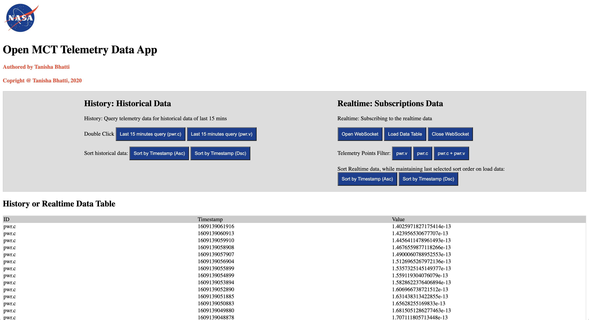

## TELEMETRY DATA APP

  

The app is divided in two options: historical or reatime data.

# Historical data section:
 is used for querying on the historical endpoint for last 15 minutes of telemetry data option selected by the user, either pwr.c or pwr.v.

User can also sort the historical data subscription in ascending or desending order.

# Realtime data section:
 is used subsribing to the realtime data enpoint based on selected telemetry data.

 User can open a webSocket to initiate the websocket connection primarily by clicking on "Open WebSocket".

 By default, both pwr.c and pwr.v are subscribed to upon opening the web socket. User will be able to see the data upon clicking on "Load Data" once or multiple times.

 User can choose to subscribe the telemetry point of their choice, either pwr.c or pwrc.v or both pwr.c + pwr.v, by clicinkg on the corresponding Telemetry Point Filter button.

 User can also sort the realtime data subscription in ascending or desending order.
 After selecting the soring order, if the user clicks on "Load Data" again to load new subscriptions, the new data will remain displayed in last selected sorting order.

 User can close the websocket by clicking on "Close WebSocket" button after using the application.

# History or Realtime Data Table:
 Data table towards the bottom of the application displays either the historical data or the realtime data upon user selection in the given section of their choice.

# RUNNING APP

## RUNNING SERVER
- git clone https://github.com/nasa/openmct-tutorial.git
- cd openmct-tutorial
- npm install
- npm start

## OPEN INDEX.HTML in LOCAL HTTP-SERVER
- Upload the index.html file to local http server for hosting your web application.
- Open the index.html file on localhost.

## CORS 

app.use(function(req, res, next) { 
    res.header("Access-Control-Allow-Origin", "http://localhost:8081"); 
    res.header("Access-Control-Allow-Headers", "Origin, X-Requested-With, Content-Type, Accept");
    next();
});

where "http://localhost:8081" is replaced with the details of the http server
hosting your web application.

# SERVER

## ENDPOINTS
-  http://localhost:8080/history​  -An httpserver for “historical” dataqueries.
-  ws://localhost:8080/realtime​   -A websocket endpoint for subscribing to realtime data.

## QUERY PARAMS

- http://localhost:8080/history/:pointId?start=:start&end=:end

- http://localhost:8080/history/pwr.v?start=1561846955890&end=1561848320152

- [{"timestamp":1561848196179,"value":241.70507498990156,"id":"pwr.v"}, {"timestamp":1561848197181,"value":238.10697171005611,"id":"pwr.v"},{ "timestamp":1561848198182,"value":233.80084678058353,"id":"pwr.v"}]

## WEBSOCKET

- ws://localhost:8080/realtime

- subscribe :pointId
subscribe pwr.v

- unsubscribe :pointId
unsubscribe pwr.v

- {"timestamp":1561848196179,"value":241.70507498990156,"id":"pwr.v"}

# COPYRIGHT @ TANISHA BHATTI, 2020
